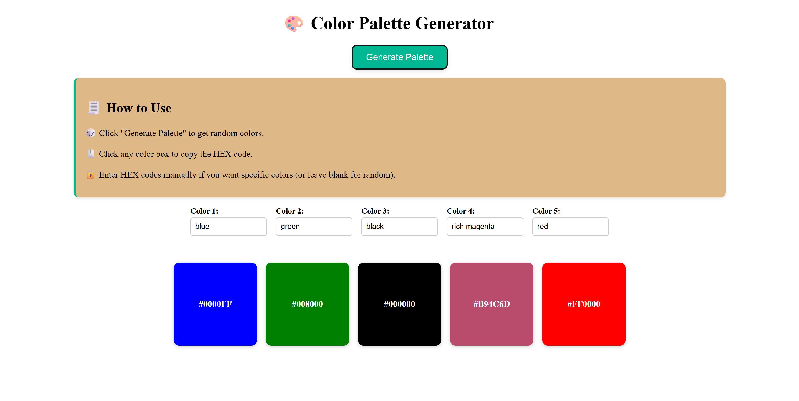

# 🎨 Color Palette Generator

A simple and beautiful web application to generate color palettes using random colors, HEX codes, or even color names like `red`, `skyblue`, etc.

---

## 🚀 Features

- 🔄 Generate a fresh color palette with one click
- 🎨 Input either HEX codes or color names (like `magenta`, `crimson`, etc.)
- 🖱️ Click any color block to copy its HEX code
- 🌈 Leave inputs empty for auto-generated random colors
- 📱 Responsive layout for mobile and desktop

---

## 📷 Demo

---

## 🛠️ Technologies Used

- **HTML**
- **CSS** (Flexbox + Responsive Design)
- **JavaScript** (DOM manipulation, color validation, clipboard API)

---

## 📂 How to Use

1. Open `index.html` in any browser
2. Enter desired color names or HEX codes in the input boxes (or leave blank for random)
3. Click **Generate Palette**
4. Click any color box to **copy** its HEX code!

---

## 💡 Examples of Color Input

✅ Valid Inputs:
- `red`
- `skyblue`
- `#FF5733`
- `#000`
- `orchid`

❌ Invalid Inputs:
- `bluered`
- `#ZZZZZZ`

---

## 🌐 Live Site (Optional)

You can host it using GitHub Pages or Netlify.  
_Example: [Live Demo]( https://sakshigapat.github.io/Colour-Palette-Generator/)_

---

